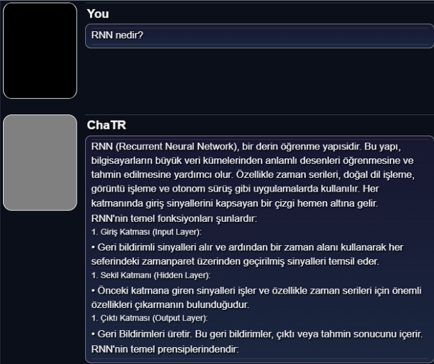
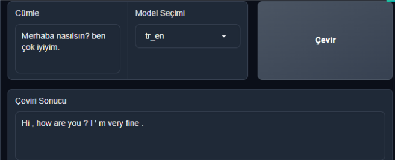
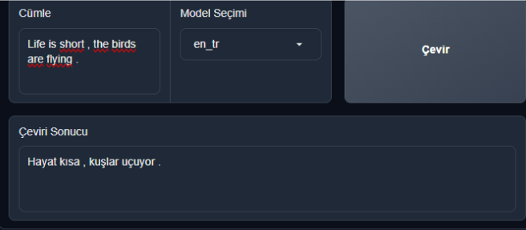

# Mini ChatGPT-Turkish Project
Main goal was trying to achieve customized ChatGPT like model which can answer questions about specific fields in Turkish. At first we’ve tried various NMT models like OpenNMT, Tensorflow NMT to achieve accuracy on the translation of sentences, then we’ve installed the fine tuned Llama 2 and Vicuna models on graido web site along with the seperate functional NMT model.

In TranslateModel folder which is used for NMT operations in the gradio website, we've used this [nmt](https://github.com/snnclsr/nmt) for referance.
For the LLM model [meta-llama/Llama-2-13b-chat-hf](https://huggingface.co/meta-llama/Llama-2-13b-chat-hf) and [lmsys/vicuna-7b-v1.5](https://huggingface.co/lmsys/vicuna-7b-v1.5) has been fine tuned then integrated into gradio website.

You need to download your trained NMT models and fine tuned LLM models in order to run this project. I couldn't able to upload our trained models in github since the both models will exceed upload limit but here are some pictures after fine tuning.

NMT translation

